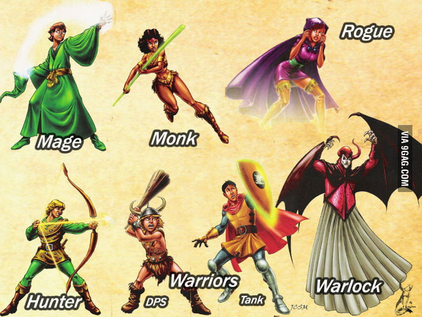

# Java-CLI-Dungeons-N-Dragons-Project




You will create a Dungeons N Dragons Style game in the command line. The behavior of the game should be as follows:

* The game randomly generates three characters for Player 1 (Human Player) and three characters for Player 2 (Computer).
* The game displays information about the characters. For example:
```java
Your Team
--------------------------------------------------------------------
Orge (1)                Druid (2)               Wizard (3)      
 - Health: 20 / 20       - Health: 10 / 10       - Health: 12 / 12
 - Attack: 9             - Attack: 8             - Attack: 4
 - Defense: 3            - Defense: 9            - Defense: 8
 - Speed: 1              - Speed: 3              - Speed: 10
 
Enemy Team
---------------------------------------------------------------------
Warrior (1)             Paladin (2)             Rogue (3)      
 - Health: 20 / 20       - Health: 10 / 10       - Health: 20 / 20
 - Attack: 4             - Attack: 10            - Attack: 7
 - Defense: 4            - Defense: 5            - Defense: 4
 - Speed: 8              - Speed: 7              - Speed: 2
```
* The game asks you to select one of your characters and one of the computer's characters to fight each other.
```text
Your turn!
Attack with: 3
Attack enemy: 1
```
* The two characters fight based on the following procedure:
  1. The character with the higher speed attacks first
  2. The attacking player rolls a standard die and has that amount temporarily added to their character's attack
  3. The defending player also rolls a die and has that amount temporarily added to their character's defense
  4. If the attacking character's attack is higher than the defending character's defense, the difference is removed from the defending character's health.
  5. If the defending character's health reaches 0, it is removed from the game
  6. The characters switch roles, the former defender becomes the attacker and vise versa. Steps 2-5 are repeated

```text
Your Wizard attacks first!
Your Wizard's attack: Base of 4 + Role of 3 = 7
Enemy Warrior's defense: Base of 4 + Role of 1 = 5
Your Wizard deals 2 damage to the Enemy Warrior!

Enemy Warrior counterattacks!
Enemy Warrior's attack: Base of 4 + Role of 5 = 9
Your Wizard's defense: Base of 8 + Role of 2 = 10
Enemy Warrior deals 0 damage to Your Wizard!
```
* The computer then selects one of its characters to attack with and one of your players to attack. We recommend having the computer pick randomly initially but feel free to build your own AI!

* This continues until one player's team is eliminated, in which the other player wins!
```java
Your Team
--------------------------------------------------------------------
Orge (1)                Druid (2)               
 - Health: 5 / 20       - Health: 1 / 10      
 - Attack: 9             - Attack: 8         
 - Defense: 3            - Defense: 9          
 - Speed: 1              - Speed: 3      
 
Enemy Team
---------------------------------------------------------------------
Warrior (1)          
 - Health: 2 / 20   
 - Attack: 4        
 - Defense: 4        
 - Speed: 8
 
 ... After additional attack ...
 
 You defeated all the Enemy characters...You won!
 
```

Hint: it will be helpful to use inheritance and polymorphism. Have a class called Character, and have a class called Ogre that extends Character, and so on.
